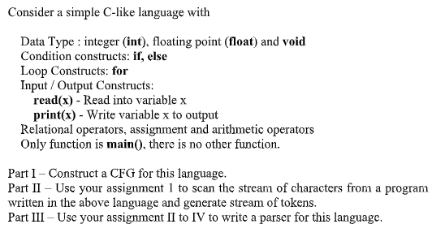

# compiler

### Assignment1
Write a C program to convert a program written in simple and restricted C
language into a stream of tokens.

### Assignment2
Write a program for removing immediate and non-immediate left recursion in a
grammar. The grammar will be stored in a text file. Your program will read the text file,
remove left recursion and output the new grammar in an output file.

### Assignment3
Write a program to compute the FIRST and FOLLOW set of a given grammar. The
grammar is to be stored in a text file which will be input to your program.
The symbols of the grammar are strings, the left recursion is already removed
(considering that your assignment 2 program has taken care of left recursion removal).

### Assignment4
Construct an LL(1) parser. The parser should read any grammar which is input as a
file, construct the parsing table for that grammar.
Next the parser should take an input file and check whether the string in the input file is
acceptable and report errors, if any, with locations.

### Assignment5

